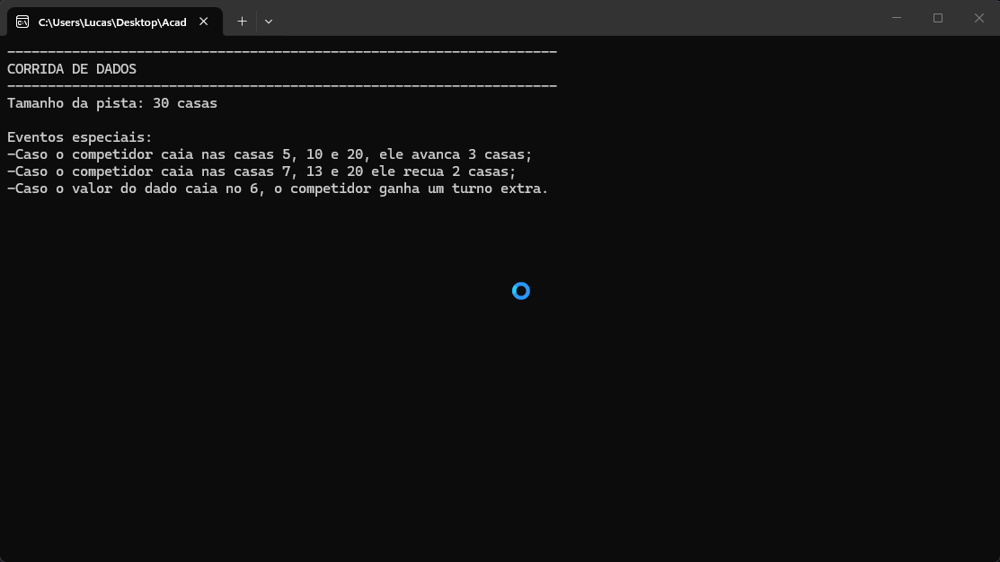

# Corrida de Dados

Jogo desenvolvido no curso de Back-End da [Academia do Programador](https://academiadoprogramador.net) 2026
# Introdução

Jogo desenvolvido utilizando a linguagem c#. Utiliza estruturas de repetição, estruturas de decisão e gereação de números aleatórios.

# Regras do Jogo

Consiste em uma pista com 30 casas. O jogador pressiona enter no console para jogar um dado, e compete com a máquina a cada turno, o primeiro a alcançar a ultrapassar a casa 30 ganha o jogo.

## Eventos especiais:

- Avanço extra: Se o competidor parar em uma posição específica (ex.: 5, 10, 15), ele avança +3
casas.
- Recuo: Se o competidor parar em outra posição específica (ex.: 7, 13, 20), ele recua -2 casas.
- Rodada Extra: Se o competidor tirar 6 no dado, ele ganha uma rodada extra.

# Como utilizar o programa

1. Clone ou baixe os arquivos do Repositório
2. Abra o emulador de terminal e navegue até a pasta raiz do projeto baixado
3. Utilize o comando para restaurar as dependências do projeto:

``
dotnet restore
``

4. Em seguida compile o projeto com o comando:

``
dotnet run --project JogodoDado.ConsoleApp1
``

# Requisitos
- .NET 10.0 SDK
